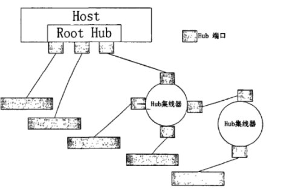
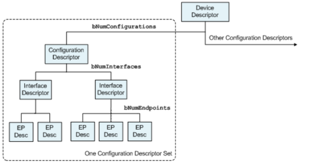

Стек протоколов хоста
=========================

Для информации о именовании, категоризации и составе структур в стеке протоколов хоста смотрите следующие два рисунка:

CORE
-----------------

Структура информации CLASS-драйвера
""""""""""""""""""""""""""""""""""""

.. code-block:: C

    struct usbh_class_info {
        uint8_t match_flags; /* Используется для сопоставления с конкретными продуктами; диапазон включительный */
        uint8_t class;       /* Основной код класса устройства */
        uint8_t subclass;    /* Подкласс, зависит от основного класса. Например, */
        uint8_t protocol;    /* Протокол, зависит от основного класса. Например, */
        uint16_t vid;        /* Идентификатор производителя (для устройств конкретного производителя/продукта) */
        uint16_t pid;        /* Идентификатор продукта (для устройств конкретного производителя/продукта) */
        const struct usbh_class_driver *class_driver;
    };

Структура конечной точки
""""""""""""""""""""""""""""""""""""

.. code-block:: C

    struct usbh_endpoint {
        struct usb_endpoint_descriptor ep_desc;
    };

Структура альтернативного интерфейса
""""""""""""""""""""""""""""""""""""

.. code-block:: C

    struct usbh_interface_altsetting {
        struct usb_interface_descriptor intf_desc;
        struct usbh_endpoint ep[CONFIG_USBHOST_MAX_ENDPOINTS];
    };

Структура интерфейса
""""""""""""""""""""""""""""""""""""

.. code-block:: C

    struct usbh_interface {
        struct usbh_interface_altsetting altsetting[CONFIG_USBHOST_MAX_INTF_ALTSETTINGS];
        uint8_t altsetting_num;
        char devname[CONFIG_USBHOST_DEV_NAMELEN];
        struct usbh_class_driver *class_driver;
        void *priv;
    };

Структура конфигурации
""""""""""""""""""""""""""""""""""""

.. code-block:: C

    struct usbh_configuration {
        struct usb_configuration_descriptor config_desc;
        struct usbh_interface intf[CONFIG_USBHOST_MAX_INTERFACES];
    };

Структура hubport
""""""""""""""""""""""""""""""""""""

.. code-block:: C

    struct usbh_hubport {
        bool connected;   /* True: устройство подключено; false: отключено */
        uint8_t port;     /* Индекс порта хаба */
        uint8_t dev_addr; /* адрес устройства */
        uint8_t speed;    /* скорость устройства */
        usbh_pipe_t ep0;  /* информация о трубе управляющей конечной точки */
        struct usb_device_descriptor device_desc;
        struct usbh_configuration config;
        const char *iManufacturer;
        const char *iProduct;
        const char *iSerialNumber;
        uint8_t *raw_config_desc;
        struct usb_setup_packet *setup;
        struct usbh_hub *parent;
    #ifdef CONFIG_USBHOST_XHCI
        uint32_t protocol; /* протокол порта, для xhci, некоторые порты являются USB2.0, другие — USB3.0 */
    #endif
        usb_osal_thread_t thread;
    };

Структура хаба
""""""""""""""""""""""""""""""""""""

.. code-block:: C

    struct usbh_hub {
        usb_slist_t list;
        bool connected;
        bool is_roothub;
        uint8_t index;
        uint8_t hub_addr;
        usbh_pipe_t intin;
        uint8_t *int_buffer;
        struct usbh_urb intin_urb;
        struct usb_hub_descriptor hub_desc;
        struct usbh_hubport child[CONFIG_USBHOST_MAX_EHPORTS];
        struct usbh_hubport *parent;
    };

usbh_initialize
""""""""""""""""""""""""""""""""""""

``usbh_initialize`` используется для инициализации стека протоколов USB-хоста, включая: инициализацию контроллера USB-хоста, создание устройства roothub и создание потока для обнаружения хаба.

.. code-block:: C

    int usbh_initialize(void);

usbh_find_class_instance
""""""""""""""""""""""""""""""""""""

``usbh_find_class_instance`` используется для поиска соответствующего дескриптора структуры class по имени зарегистрированного class.

.. code-block:: C

    void *usbh_find_class_instance(const char *devname);

- **devname**  имя class
- **return**  дескриптор структуры class

lsusb
""""""""""""""""""""""""""""""""""""

``lsusb`` используется для просмотра и управления информацией об устройствах на хабе. Требуется плагин shell для использования.

.. code-block:: C

    int lsusb(int argc, char **argv);

CDC ACM
-----------------

HID
-----------------

MSC
-----------------

RNDIS
-----------------

PRINTER
-----------------