.. Руководство по использованию CherryUSB, основной файл документации, созданный
   с помощью sphinx-quickstart 21 ноября 2019 года.
   Вы можете полностью адаптировать этот файл по своему усмотрению, но он должен, как минимум,
   содержать корневую директиву `toctree`.

Руководство по использованию CherryUSB
======================================================

CherryUSB — это компактный, высокопортативный USB стек протоколов для встраиваемых систем. Кроме того, CherryUSB имеет следующие преимущества:

**Легкость изучения USB**

Для удобства пользователей в изучении основ USB, перечисления, загрузки драйверов, IP-драйверов, написанный код имеет следующие преимущества:

- Код минималистичен, логика проста, без сложных синтаксических конструкций языка C
- Иерархическое программирование, код постепенно усложняется
- Шаблоны для драйверов Class и портовых драйверов упрощены
- Четкая категоризация API (для слейвов: инициализация, регистрация классов, обратные вызовы, отправка и прием данных; для хостов: инициализация, поиск, отправка и прием данных)

**Легкость использования USB**

Для удобства пользователей в использовании интерфейса USB и учета их знаний об UART и DMA, разработанный интерфейс для приема и отправки данных имеет следующие преимущества:

- Эквивалентен использованию UART tx DMA/UART rx DMA
- Нет ограничений на длину передачи, пользователю не нужно заботиться о разбиении пакетов USB (разбиение пакетов выполняется драйвером порта)

**Легкость использования производительности USB**

С учетом производительности USB и стремления достичь теоретической пропускной способности USB, разработанный интерфейс для приема и отправки данных имеет следующие преимущества:

- Драйвер порта напрямую работает с регистрами, без абстрактного слоя
- Memory zero copy
- Если IP поддерживает DMA, то используется режим DMA (с функцией аппаратного разбиения пакетов)
- Нет ограничений по длине, что облегчает взаимодействие с аппаратным DMA и использование его преимуществ
- Разбиение пакетов обрабатывается в прерываниях

**Исполнение стека протоколов в режиме слейв**

.. figure:: usbdev.svg

**Исполнение стека протоколов в режиме хоста**

**Другие полезные ссылки**

- **Контур CherryUSB** https://www.bilibili.com/video/BV1st4y1H7K2
- **Видео-руководство по стеку протоколов в режиме слейв** https://www.bilibili.com/video/BV1Ef4y1t73d
- **Видео-руководство по стеку протоколов в режиме хоста** TODO
- **GitHub** https://github.com/sakumisu/CherryUSB

.. toctree::
   :maxdepth: 1
   :caption: Быстрый старт

   quick_start/index
   quick_start/rt-thread/rtthread
   quick_start/other_chip

.. toctree::
   :maxdepth: 1
   :caption: Основные понятия USB

   usb/usb2.0_basic
   usb/usb3.0_basic
   usb/usb_desc
   usb/usb_request
   usb/usb_enum

.. toctree::
   :maxdepth: 1
   :caption: Руководство по API

   api/api_device
   api/api_host
   api/api_port
   api/api_config

.. toctree::
   :maxdepth: 1
   :caption: Руководство по классам

   class/class_cdc
   class/class_hid
   class/class_msc
   class/class_audio
   class/class_video
   class/winusb

.. toctree::
   :maxdepth: 1
   :caption: Базовые примеры

   demo/cdc_acm
   demo/msc_ram
   demo/audio_mic_speaker
   demo/usb_video

.. toctree::
   :maxdepth: 1
   :caption: Инструкции по портированию

   porting
   porting_usbip

.. toctree::
   :maxdepth: 1
   :caption: Использование инструментов

   tools/index
