Быстрая проверка на основе существующего демо
=============================================

Перед изучением USB или кода CherryUSB необходимо сначала провести быструю проверку на основе существующего демо. Почему? Чтобы повысить интерес к USB и иметь уверенность в следующих шагах. Если демо не работает, или вы пытаетесь самостоятельно написать код, или начать с основных понятий USB, и в конце концов обнаружить, что вы ничего не понимаете, это может привести к потере интереса к USB. Поэтому первоначальный запуск демо очень важен. Ниже перечислены поддерживаемые на данный момент репозитории с демо.

На основе серии микросхем bouffalolab
--------------------------------------

Репозиторий для справки: https://github.com/CherryUSB/cherryusb_bouffalolab

- BL702 — это USB2.0 полноскоростная микросхема с 8 конечными точками (включая конечную точку 0). Поддерживает только режим ведомого устройства.
- BL616/BL808 — это USB2.0 микросхема с встроенным высокоскоростным PHY и 5 конечными точками (включая конечную точку 0). Поддерживает режимы хоста и устройства.
- Соответствующие приложения для USB находятся в директориях `examples/usbdev` и `examples/usbhost`. После установки официальной среды можно компилировать и использовать.

На основе серии микросхем ST
-----------------------------

Репозиторий для справки: https://github.com/CherryUSB/cherryusb_stm32

По умолчанию предоставляются следующие демо-проекты:

- F103 использует fsdev ip.
- F429 использует hs port в режимах хоста и устройства, а также использует режим DMA.
- H7 использует fs port для устройства и hs port для хоста, причем хост поддерживает кэширование.

По умолчанию удалены драйверы, поэтому необходимо сгенерировать их с помощью stm32cubemx. В демо предоставлен файл **stm32xxx.ioc**, дважды щелкните по нему, затем нажмите **Generate Code**.

.. caution:: После генерации используйте функцию git reset для возврата измененных файлов `main.c` и `stm32xxx_it.c`. Запрещено перезаписывание cubemx.

Охватывает F1/F4/H7, остальные микросхемы аналогичны, подробности не описываются. Конкретные различия:

- различия в usb ip: F1 использует fsdev, F4/H7 использует dwc2
- различия в dwc2 ip: fs port (пины PA11/PA12) и hs port (пины PB14/PB15), при этом hs port по умолчанию работает в полноскоростном режиме и может подключаться к внешнему PHY для формирования высокоскоростного хоста с поддержкой DMA.
- различия в кэше и USB BASE между F4 и H7

Если используется STM32F7/STM32H7 с функцией кэширования, необходимо расположить используемую в USB оперативную память в области no cache ram. Пример:

.. code-block:: C

    cpu_mpu_config(0, MPU_Normal_NonCache, 0x24070000, MPU_REGION_SIZE_64KB);

Изменение скрипта sct в Keil:

.. code-block:: C

    LR_IROM1 0x08000000 0x00200000  {    ; размер области загрузки size_region
    ER_IROM1 0x08000000 0x00200000  {  ; адрес загрузки = адрес выполнения
    *.o (RESET, +First)
    *(InRoot$$Sections)
    .ANY (+RO)
    .ANY (+XO)
    }
    RW_IRAM2 0x24000000 0x00070000  {  ; данные RW
    .ANY (+RW +ZI)
    }
    USB_NOCACHERAM 0x24070000 0x00010000  {  ; данные RW
    *(.noncacheable)
    }
    }

.. caution :: Если вы используете STM32F7 или STM32H7, добавьте в CFLAG макроопределение STM32F7 или STM32H7, иначе устройство не будет перечислено

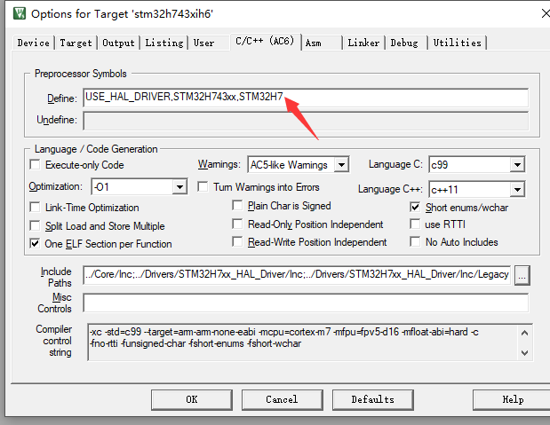

Ключевые моменты при портировании USB Device
^^^^^^^^^^^^^^^^^^^^^^

- Создайте проект с помощью **stm32cubemx**, настройте основные RCC, UART (используется для log)

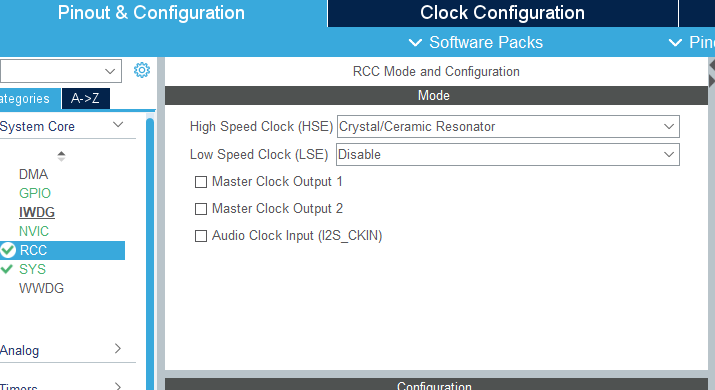
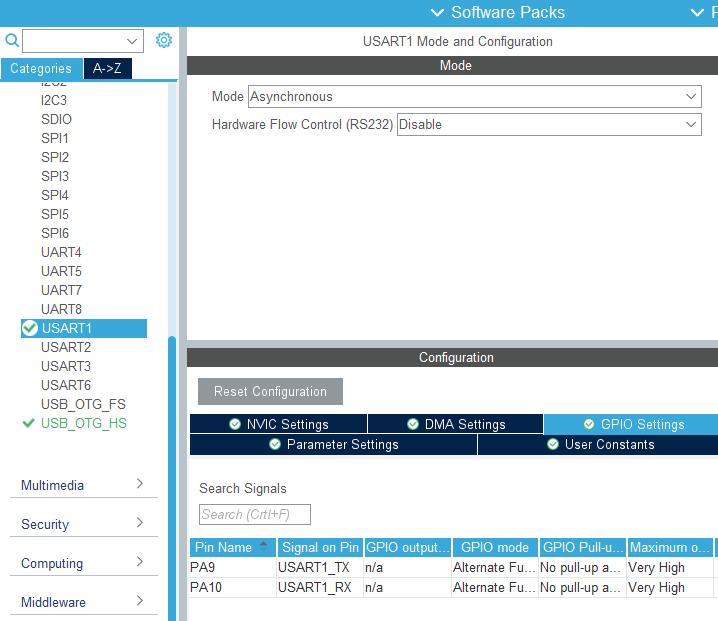

- Если используется fsdev ip, выберите **USB**. Если используется dwc2 ip, выберите **USB_OTG_FS** или **USB_OTG_HS**. Включите прерывания USB, другие настройки нам не нужны, в коде не будут использоваться библиотеки USB от ST.

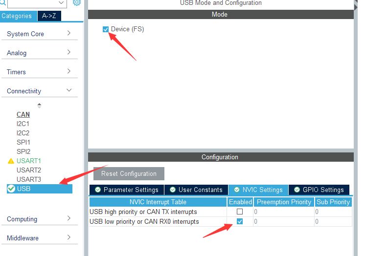
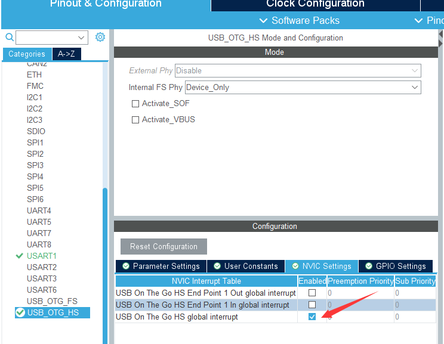

- Настройте тактирование USB на 48МГц

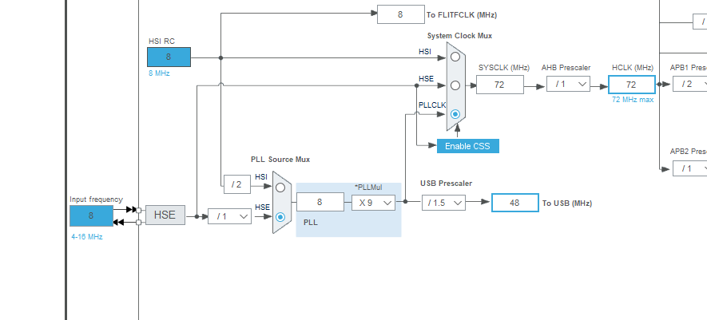
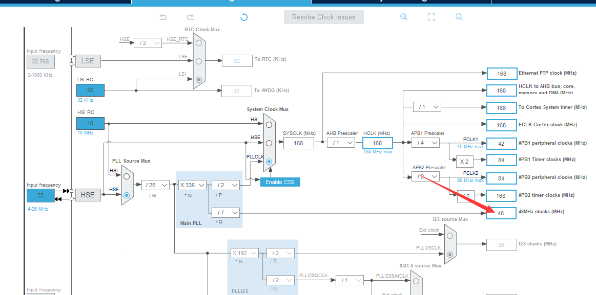

- Выберите нужный проект, здесь мы выбираем keil, настройте stack и heap, для msc рекомендуется установить больший размер, затем нажмите **Generate Code**.

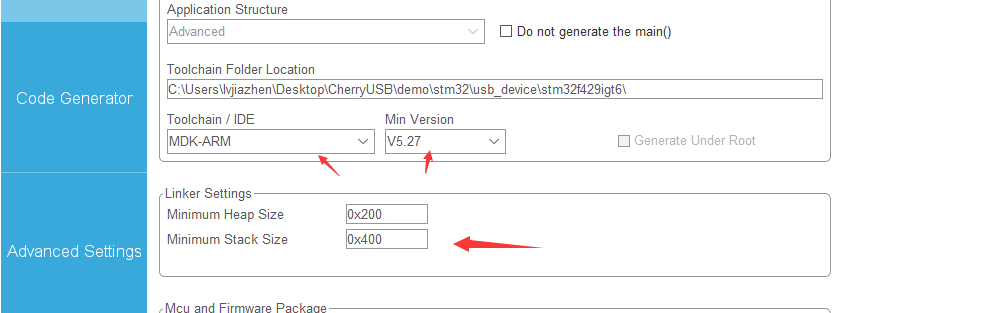

- Добавьте необходимые исходные файлы CherryUSB ( **usbd_core.c**, **usb_dc_dwc2.c** или **usb_dc_fsdev.c** ), а также нужные драйвера класса, можно добавить соответствующие шаблоны класса для удобства тестирования.

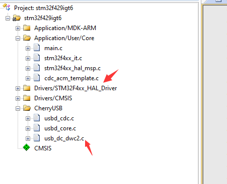

- Добавьте необходимые заголовочные файлы

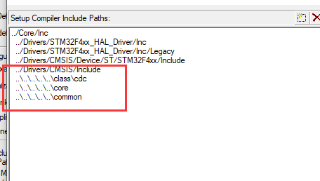

- Скопируйте шаблон **cherryusb_config_template.h**, поместите его в директорию `Core/Inc` и переименуйте в `usb_config.h`

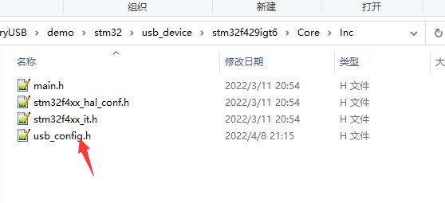

- Если используется dwc2 ip, в опциях компиляции нужно добавить `CONFIG_USB_DWC2_PORT=xxx`, если используется PA11/PA12, то **xxx=FS_PORT**, если используется PB14/PB15, то **xxx=HS_PORT**

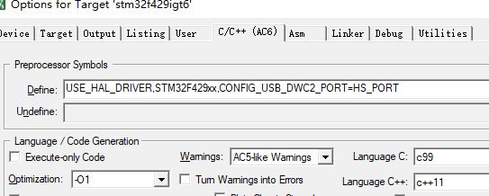

- Для компиляции рекомендуется использовать **AC6**. Выберите **Microlib** и реализуйте **printf** для удобства последующего просмотра log.

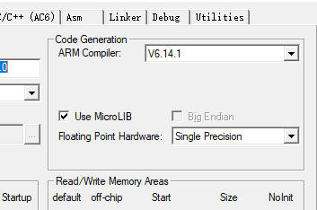
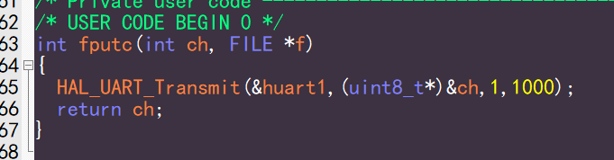

- Скопируйте содержимое функции **HAL_PCD_MspInit** из файла **xxx_msp.c** в функцию **usb_dc_low_level_init**, отключите сгенерированные ST функции прерываний USB и инициализацию USB

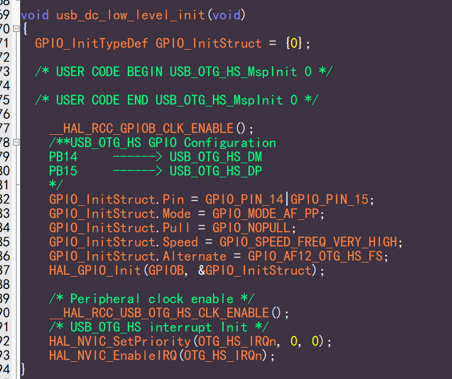
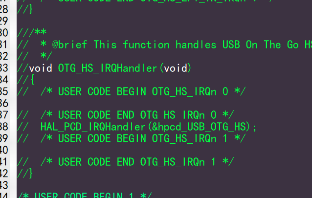
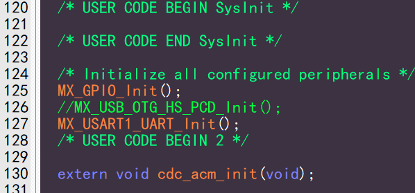

- Вызовите содержимое шаблона для инициализации, и вы сможете его использовать

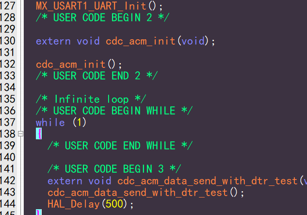

Ключевые моменты при портировании USB Host
^^^^^^^^^^^^^^^^^^^^^^

Первые 7 шагов такие же, как и для Device. Необходимо обратить внимание, что драйвер host поддерживает только hs port с dma (контакты PB14/PB15), поэтому fs port (контакты PA11/PA12) не поддерживается (без dma что за хост).

- Добавьте необходимые исходные файлы CherryUSB ( **usbh_core.c**, **usbh_hub.c**, **usb_hc_dwc2.c**, а также файлы адаптационного слоя в директории **osal**) и класс драйвера, который вы хотите использовать. Также можно добавить соответствующий **usb host.c** для удобства тестирования.

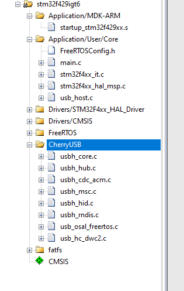

- Для компиляции рекомендуется использовать **AC6**. Выберите **Microlib** и реализуйте **printf** для удобства последующего просмотра log.

- Скопируйте содержимое функции **HAL_HCD_MspInit** из файла **xxx_msp.c** в функцию **usb_hc_low_level_init**, отключите сгенерированные ST функции прерываний USB и инициализацию USB.

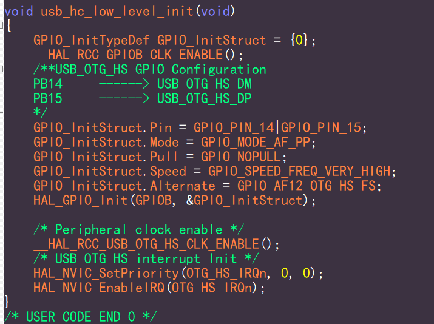

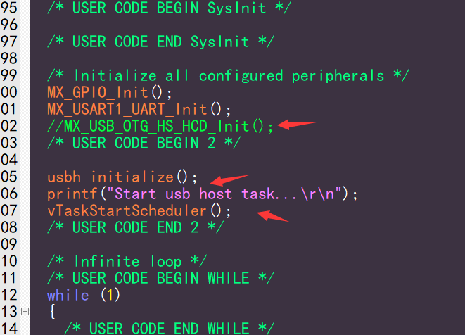

- Вызовите **usbh_initialize** и функции ос для запуска потока, и вы сможете его использовать.

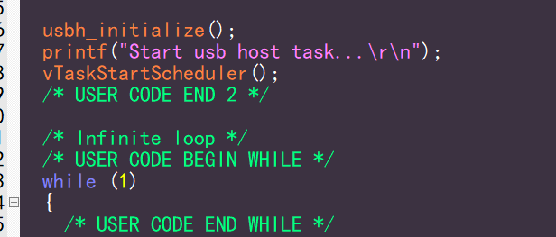

- Если используется **msc** и присутствует файловая система, вам необходимо самостоятельно добавить файлы файловой системы. Примеры портирования смотрите в файле **fatfs_usbh.c**.

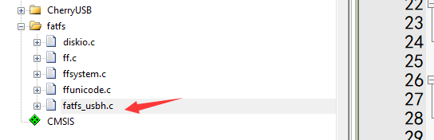

На основе серии чипов HPMicro
---------------------------

Ссылка на репозиторий: https://github.com/CherryUSB/cherryusb_hpmicro

- Все чипы серии HPM поддерживают USB 2.0 и встроенный высокоскоростной PHY, поддерживают режимы хоста и устройства.
- Связанные с USB примеры находятся в `samples/cherryusb`, после настройки официальной среды, их можно компилировать и использовать. 
