Руководство по разработке на основе пакета RT-Thread
=====================================

Этот раздел основно рассматривает использование менеджера пакетов RT-Thread для настройки проекта с использованием env в качестве демонстрации. Эта процедура одинакова для различных микроконтроллеров, и в последующем не будет повторяться. После открытия env используйте menuconfig для входа в менеджер пакетов и выберите CherryUSB по пути, показанному на рисунке.

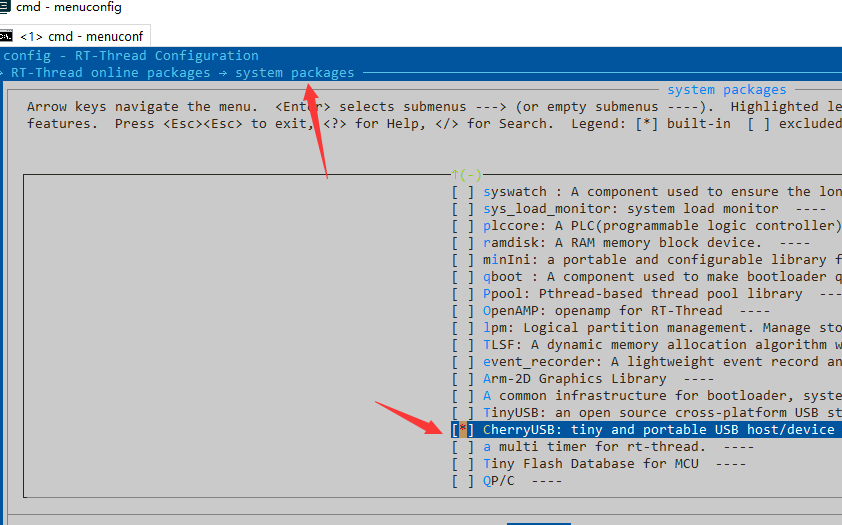

Настройка устройства
------------------------

* Выберите Enable usb device mode и нажмите Enter для входа.

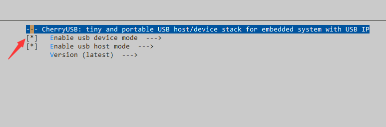
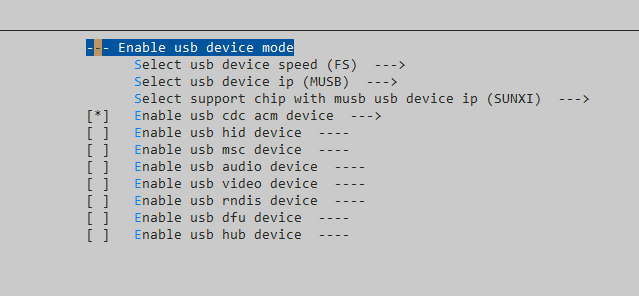

* Первая настройка — это скорость USB, которая может быть **FS (Full Speed)** или **HS (High Speed)**.

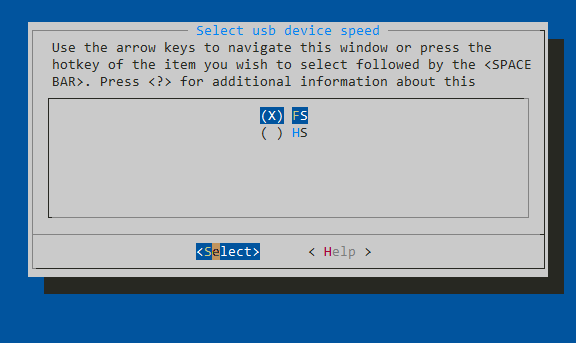

* Вторая настройка — это выбор USB device IP. Если вы не знаете, какой IP у вашего чипа, вы можете обратиться к readme в соответствующем каталоге **port**.

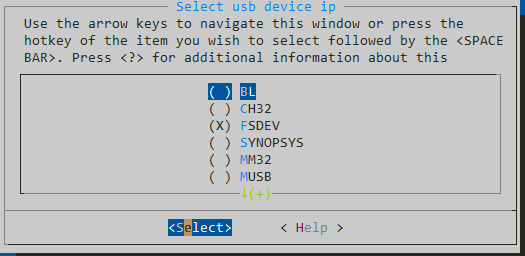

* После выбора USB device IP, вам также потребуется выбрать модель чипа. Третья настройка служит для этого, и после выбора чипа будут автоматически настроены соответствующие параметры, такие как `USB_BASE`, `USBD_Handler` и другие специальные настройки. Если ваш чип не найден, вы можете вручную изменить его в файле `usb_dc_xxx.c`.

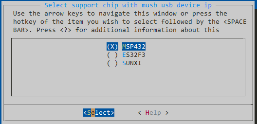

* Далее идет выбор класса. Выберите нужный класс, и после этого можно будет выбрать шаблон демо для компиляции. Конечно, можно и не выбирать, а написать код самостоятельно.

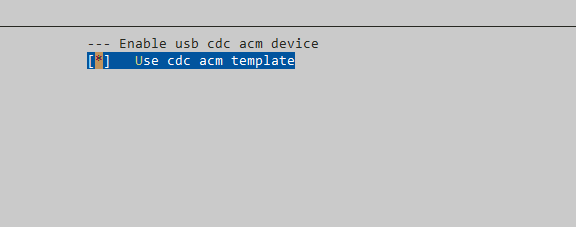

* Наконец, сохраните и выйдите.
* После выхода не спешите компилировать, сначала в коде реализуйте функцию `usb_dc_low_level_init`.
* Скопируйте `usb_config.h` в свою папку и реализуйте следующий код:

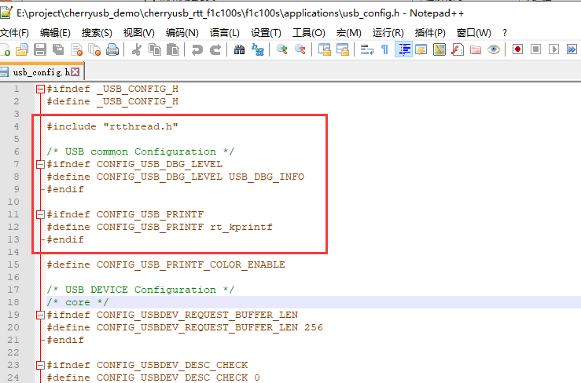

* Используйте `scons --target=mdk` или просто `scons` для компиляции.

Настройка хоста
----------------------

* Выберите Enable usb host mode и нажмите Enter для входа.

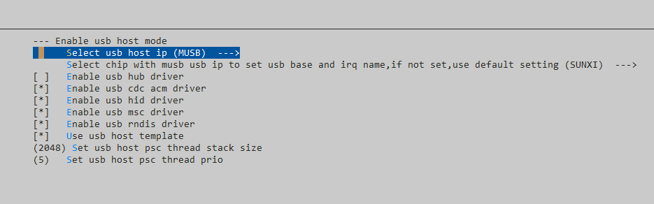

* Выберите USB host IP. Если вы не знаете, какой IP у вашего чипа, обратитесь к readme в каталоге **port**.

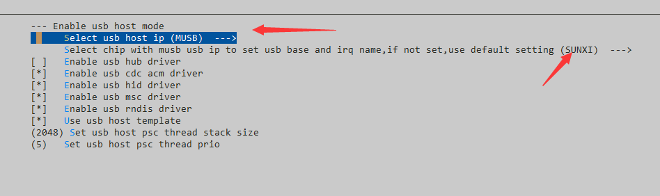

* По умолчанию включены все классы драйверов, кроме hub.
* Настройте стек и приоритеты потока psc.
* Наконец, сохраните и выйдите.
* После выхода не спешите компилировать, сначала реализуйте функцию `usb_hc_low_level_init`.
* Скопируйте `usb_config.h` в свою директорию и реализуйте следующий код:

* Используйте `scons --target=mdk` или просто `scons` для компиляции.
* Если используется GCC, добавьте следующий код в скрипт для компоновщика (ld):

.. code-block:: C

        /* информация о разделе для usbh class */
        . = ALIGN(4);
        __usbh_class_info_start__ = .;
        KEEP(*(.usbh_class_info))
        __usbh_class_info_end__ = .;

Использование STM32CubeMX для генерации инициализации USB
------------------------------------------------------------

STM32CubeMX в основном используется для генерации настроек часов, пинов и прерываний USB. Нам нужно кликнуть на файл, как показано на рисунке, и настроить часы и прерывания USB, затем кликнуть `Generate Code`.

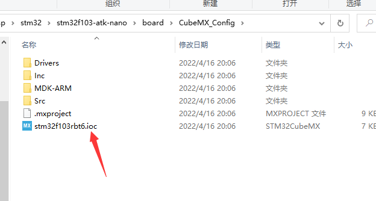
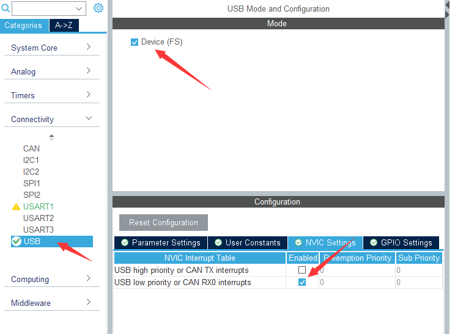
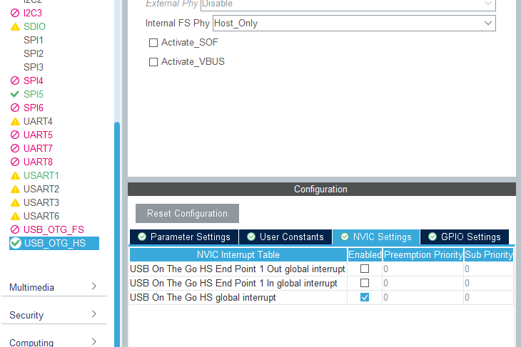
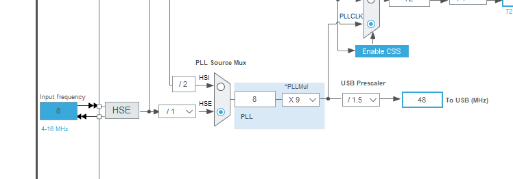

Затем скопируйте содержимое `HAL_PCD_MspInit` или `HAL_HCD_MspInit` из файла `stm32xxxx_hal_msp.c` в функции `usb_dc_low_level_init` и `usb_hc_low_level_init`. Пример:

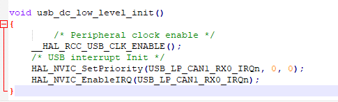

Далее, замените `SystemClock_Config` в `main.c` на настройки в `board.c`.

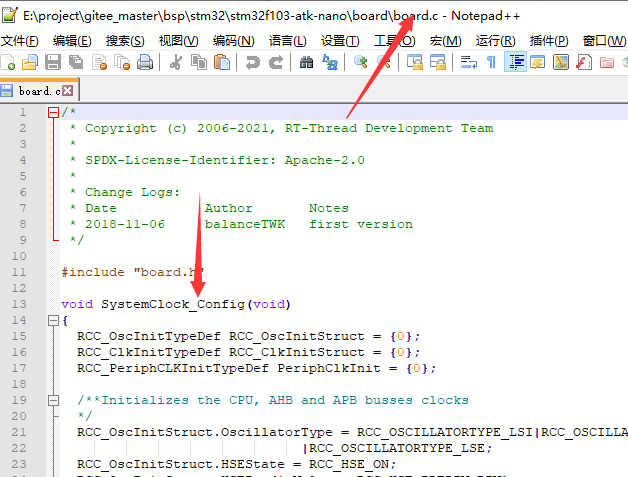
