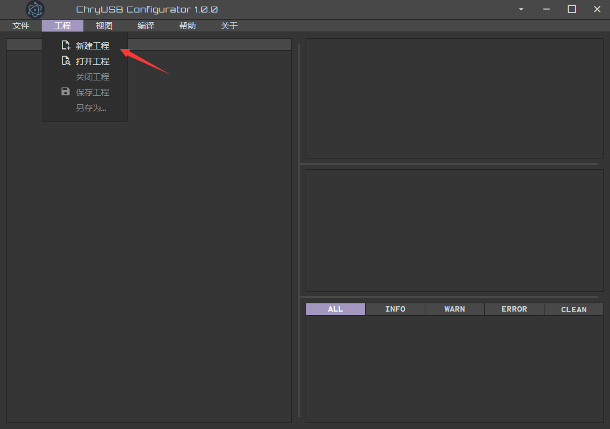
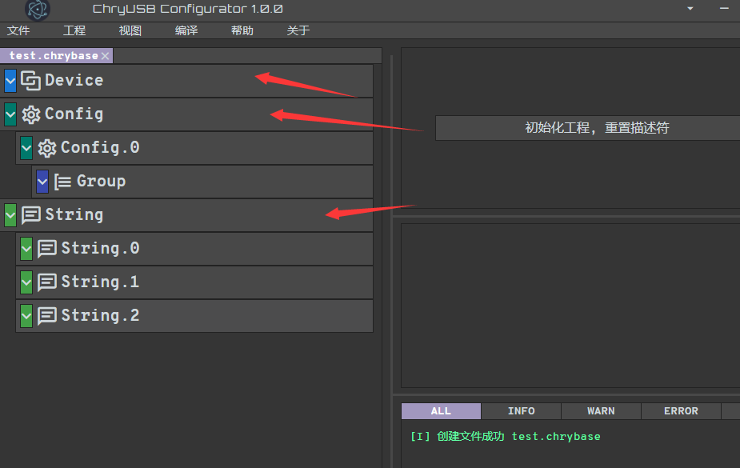
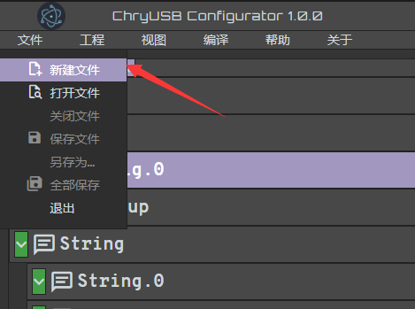
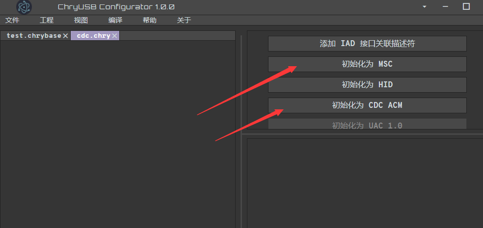
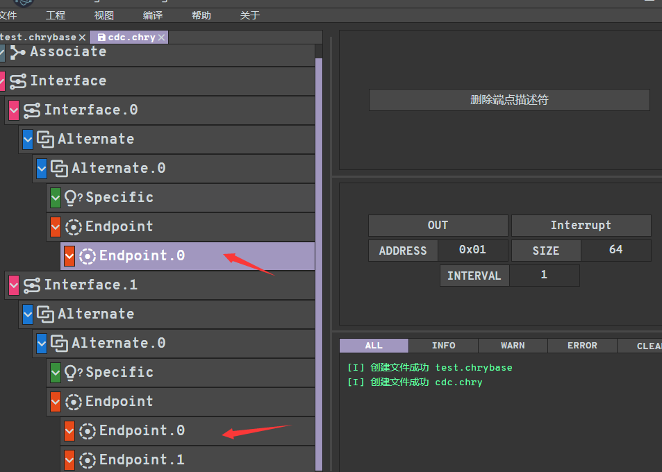
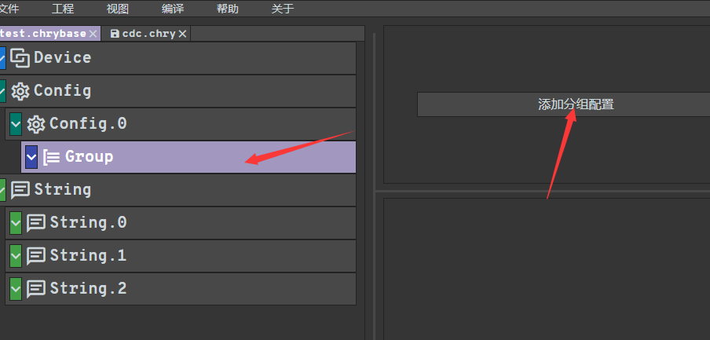
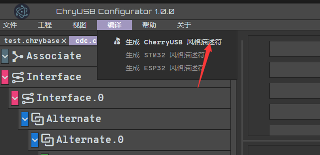

chryusb_configurator
--------------------------

`chryusb_configurator <https://github.com/CherryUSB/chryusb_configurator/releases/tag/1.0.0>`_ главным образом используется для создания массива дескрипторов при использовании стека протоколов устройства и последующей регистрации с помощью `usbd_desc_register`.

- Сначала мы скачиваем chryusb_configurator.exe с github, устанавливаем его, затем открываем, нажимаем на `Проект`, и выбираем `Создать новый проект`

- После создания нового проекта будет сгенерирована конфигурация дескриптора по умолчанию, включающая **дескриптор устройства**, **дескриптор конфигурации**, **строковые дескрипторы**, причем **строковые дескрипторы** по умолчанию поддерживают три

- Затем мы можем изменить информацию о связанных дескрипторах в соответствии с нашими потребностями, например vid, pid в **дескрипторе устройства**, параметры класса, **Power** в **дескрипторе конфигурации** и так далее

- Далее идет добавление класса, для этого нужно нажать `Файл`, затем `Создать файл`

- После этого справа будут предложены шаблоны дескрипторов для некоторых классов, выберите один для инициализации

- Если требуется несколько классов, то вышеописанные два шага необходимо повторить

- Затем мы изменяем параметры связанных конечных точек в соответствии с нашими потребностями, такие как направление, адрес, размер, интервал

- В конце необходимо нажать `Файл` и сохранить файл с расширением `.chry`
- Переключаемся на файл проекта с расширением `.chrybase`, затем нажимаем `Добавить конфигурацию группы` и импортируем только что настроенный файл класса

- Нажимаем `Проект` и `Сохранить проект`
- Нажимаем `Скомпилировать`, чтобы сгенерировать массив дескрипторов

- Скопируйте скомпилированный файл в свой проект для использования

Набор протоколов USB LeCroy
--------------------------

Wireshark
--------------------------

Audacity
--------------------------
