Основные понятия USB (в основном 2.0)
===========================

Этот документ в основном объясняет главы пять, семь, восемь и девять официального руководства по USB `usb2.0.pdf <https://www.usb.org/document-library/usb-20-specification>`_. Если вы новичок в изучении USB, рекомендуется сначала не читать этот раздел, а сначала запустить демонстрационный пример, ознакомиться с его использованием, а затем вернуться к чтению.

Введение
---------

Что такое USB? Для чего он используется? Каковы его преимущества? Вы можете найти ответы на эти вопросы с помощью поисковика, поэтому я не буду на них останавливаться. Давайте сначала поговорим о классификации интерфейсов USB и скоростей в зависимости от различных версий USB, как показано на рисунке:

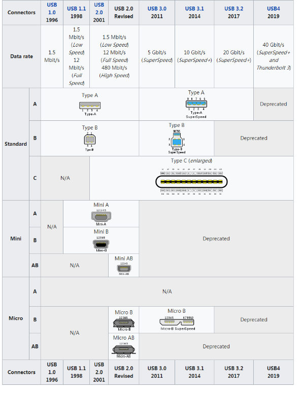

Затем нам нужно рассмотреть стандарты уровней напряжения, которым должен соответствовать USB. После определения стандартов уровней напряжения можно будет классифицировать состояния сигналов, о которых пойдет речь далее. Диапазоны поддерживаемых напряжений и максимальные токи для USB2.0 и USB3.0 приведены ниже:

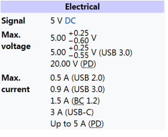

Состояния сигналов USB
-----------------

Первое, что нам нужно понять, это электрические характеристики USB, а именно Signaling Level, то есть состояния сигналов. USB в основном использует линии D+ и D-, чтобы обеспечить различные состояния сигналов для коммуникации. В разделе 7.1.7 официального руководства перечислены требования к D+ и D-, которые должны быть выполнены для состояний сигналов на низкой, полной и высокой скоростях.

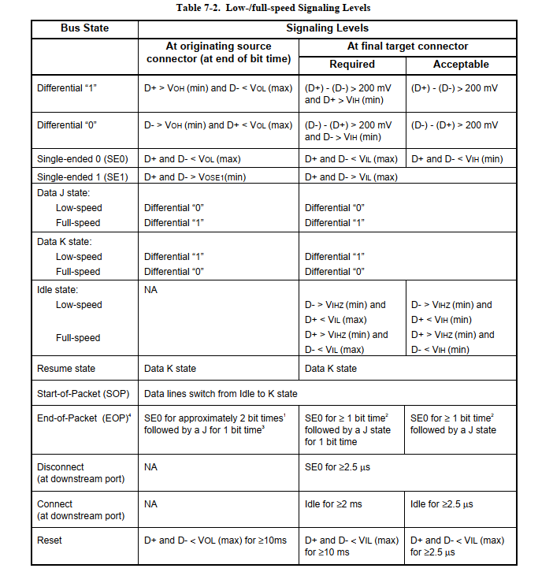
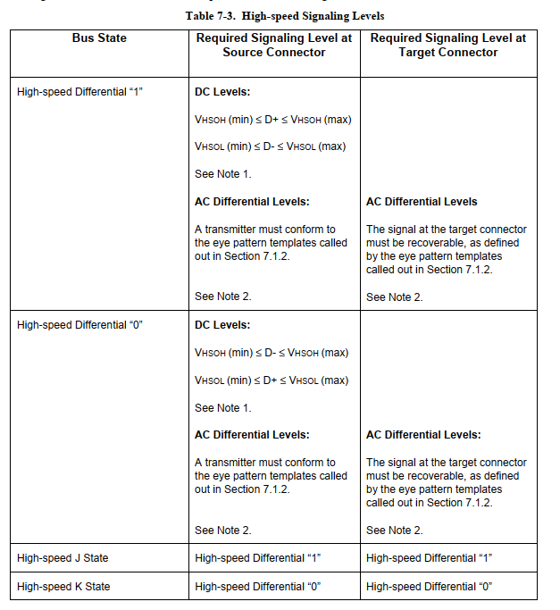
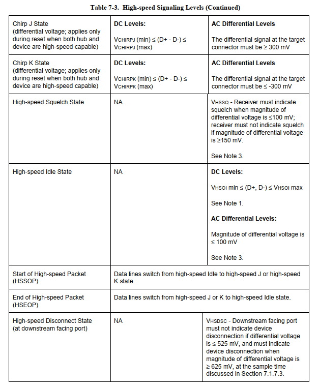

- **Дифференциальный 0 и дифференциальный 1**: Эти два состояния используются для общей передачи данных через USB. Когда линия D+ находится в состоянии высокого уровня, а линия D- в состоянии низкого уровня, состояние является дифференциальным 1. Когда линия D+ находится в состоянии низкого уровня, а линия D- в состоянии высокого уровня, состояние является дифференциальным 0.
- **Состояние J и состояние K**: Помимо дифференциальных сигналов, спецификация USB также определяет еще два дифференциальных состояния: J и K. Их определение зависит от скорости устройства. На устройствах с полной и высокой скоростью состояние J соответствует дифференциальному 1, а состояние K - дифференциальному 0. На устройствах с низкой скоростью ситуация обратная.
- **Односторонний 0 (SE0)**: Состояние, возникающее, когда и D+ и D- находятся в состоянии низкого уровня. Это состояние указывает на сброс, отключение или окончание пакета данных.
- **Односторонний 1 (SE1)**: Состояние, возникающее, когда и D+ и D- находятся в состоянии высокого уровня. Это состояние не генерируется умышленно и не должно появляться в проектировании USB.
- **Бездействие**: Состояние, которое должно возникать перед и после отправки пакета данных. Если одна из линий данных находится в состоянии низкого уровня, а другая - в состоянии высокого уровня, то это указывает на состояние бездействия. Определение высокого и низкого уровня зависит от скорости устройства. На устройствах с полной скоростью состояние бездействия означает, что D+ находится в состоянии высокого уровня, а D- - в состоянии низкого уровня. На устройствах с низкой скоростью ситуация обратная.
- **Восстановление**: Используется для пробуждения устройства из состояния ожидания. Это достигается путем отправки состояния K.
- **Начало пакета данных (SOP)**: Происходит перед началом пакета данных низкой или полной скорости, когда линии D+ и D- переходят от состояния бездействия к состоянию K.
- **Окончание пакета данных (EOP)**: Происходит в конце пакета данных низкой или полной скорости. EOP происходит, когда состояние SE0 длится два временных интервала (время будет обсуждено позже), а состояние J длится один временной интервал.
- **Сброс**: Происходит, когда состояние SE0 длится 10 мс. После того как SE0 длится как минимум 2.5 мс, устройство сбрасывается и начинает процесс сброса.
- **Поддержание активности (Keep Alive)**: Сигнал, используемый в устройствах с низкой скоростью. Устройства с низкой скоростью не имеют стартового пакета кадра (который предотвращает состояние ожидания). Каждые 1 мс они используют EOP, чтобы предотвратить переход устройства в состояние ожидания.

.. note::Здесь стоит отметить, что состояния J и K, а также дифференциальные 0/1 для низкой скорости противоположны полной/высокой скорости.

Ниже мы разберём эти сигнальные состояния, используя осциллограмму:

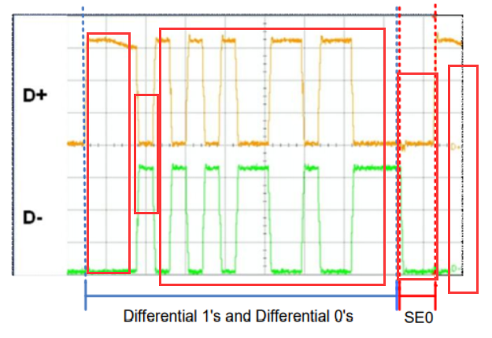

- Первый красный прямоугольник показывает начало пакета данных, и, предполагая, что это устройство полной скорости, D+ находится в высоком состоянии, а D- в низком, что является состоянием бездействия.
- Второй красный прямоугольник, где D+ в низком, а D- в высоком состоянии, что указывает на состояние K. Переход от бездействия к K означает начало пакета (SOP).
- Третий красный прямоугольник показывает данные, обозначенные как JKJKJKJKJK.
- Четвертый красный прямоугольник обозначает состояние SE0, так как D+ и D- оба находятся в низком уровне.
- Пятый красный прямоугольник показывает, что состояние SE0 длится некоторое время, после чего переходит в состояние D+ высокий и D- низкий, что указывает на состояние J. Переход из SE0 в J означает окончание пакета (EOP).

Определение скорости USB
---------------------

Как определить скорость USB? Согласно разделу 7.1.5.1 руководства, скорость USB определяется по резистору подтяжки на линиях D+ и D-. Если D+ подтянут через 1.5kΩ, устройство считается устройством полной скорости; если D- подтянут через 1.5kΩ, то устройство является устройством низкой скорости. Устройства высокой скорости изначально появляются как устройства полной скорости с резистором подтяжки 1.5kΩ на линии D+. USB 2.0 hub идентифицирует его как устройство полной скорости, затем хаб и устройство совершают серию рукопожатий, чтобы подтвердить друг друга и в итоге определить, что это устройство высокой скорости.

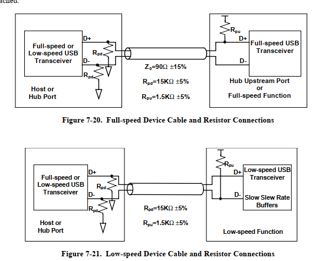

Обнаружение подключения и отключения USB
---------------------

Как USB хост определяет, когда к нему подключается или отключается устройство? Ответ находится в разделе 7.1.7.3 руководства, как показано на рисунках:

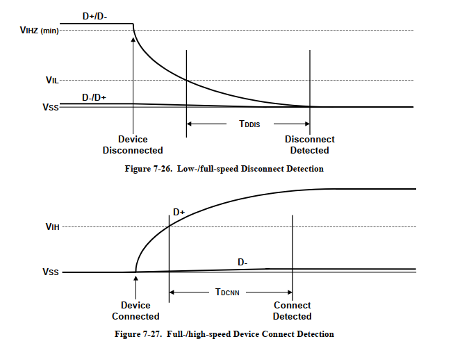
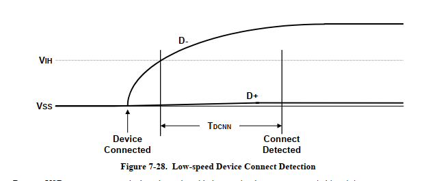

Для обнаружения подключения хост обнаруживает, что уровень одной из линий данных остаётся высоким в течение некоторого времени, что говорит о подключении устройства. Когда подключается устройство низкой скорости, хост обнаруживает, что линия D- подтянута вверх. При подключении устройства полной/высокой скорости хост видит, что линия D+ подтянута вверх. Для обнаружения отключения работают подтягивающие резисторы на D+ и D-, и после отключения обе линии находятся в низком состоянии. Если низкое состояние длится время TDDIS, то хост определяет это как отключённое состояние. На рисунке выше время TDDIS составляет от 2 до 2,5 микросекунд.

USB питание
---------------------

В качестве источника питания USB, устройства USB могут быть разделены на два типа: питаемые от шины и с собственным питанием.

- Питание от шины является одним из преимуществ USB. Поскольку устройство получает питание через шину, не требуется использовать громоздкие внутренние или внешние источники питания, и оно все еще способно поддерживать свою работу. Шина может питаться от хоста или концентратора. При использовании устройства, питаемого от шины, пользователь должен учитывать его энергопотребление перед тем, как настроить устройство в определенном состоянии.
- Устройства с собственным питанием используют внешние источники питания (например, адаптеры постоянного тока или батареи) для самостоятельного питания. При проектировании устройств с собственным питанием необходимо учитывать некоторые моменты. Спецификация USB требует, чтобы устройства с собственным питанием постоянно мониторили свою линию VBUS. В течение времени, когда VBUS отсутствует, устройство должно отключать питание от подтягивающего резистора к линиям D+/D-, чтобы предотвратить питание хоста или концентратора. В противном случае это приведет к неудаче в тестах на соответствие USB. Однако, концентраторы с собственным питанием могут получать до 100 мА тока от шины.

Состояния USB устройства
---------------------

В момент подключения USB устройства к хосту, состояние USB устройства меняется. Это состояние устройства, как будет видно позже при изучении процесса перечисления, описывает именно этот процесс перечисления. Подробности см. в руководстве 9.1.1.

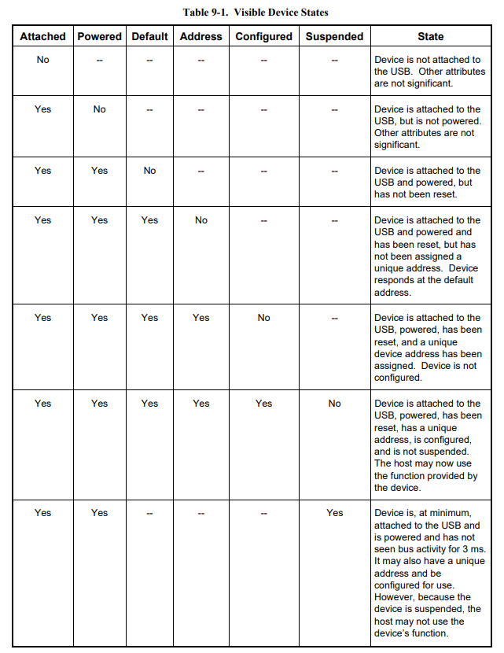

- Состояние подключения: возникает, когда устройство подключено к хосту/концентратору, но хост/концентратор не подает питание на линию VBUS. Обычно это происходит, когда концентратор обнаруживает событие перегрузки по току. Хотя устройство остается подключенным, хост убирает подачу питания к нему.
- Питаемое: устройство подключено к USB и получает питание, но еще не получило запрос на сброс.
- По умолчанию: устройство подключено к USB, получает питание и было сброшено хостом. В этот момент у устройства нет адреса. Устройство откликается на адрес 0.
- Адресное: устройство подключено к USB, получает питание, было сброшено и имеет уникальный адрес. Однако устройство еще не настроено.
- Настроенное: устройство подключено к USB, получает питание, было сброшено, имеет уникальный адрес и настроено, но еще не перешло в состояние ожидания. В этот момент устройства, питаемые от шины, могут потреблять более 100 мА тока.
- Ожидание: как было сказано выше, устройство установило соединение и настроено, но в течение 3 мс не будет проводиться никаких операций на шине.

Перевод на русский язык изображения:

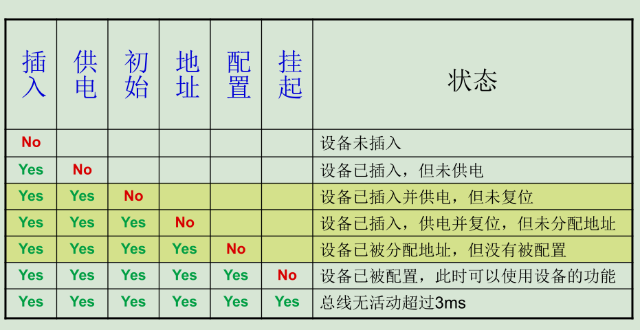

USB кодировка и битовое заполнение
---------------------

Во-первых, данные USB передаются последовательно, как в UART, I2C, SPI и так далее, последовательность сигналов 0 и 1 передается по одной линии данных получателю. Однако, из-за различий в частотах работы передатчика и приемника, синхронизация сигналов становится проблемой. Например, приемник может получить сигнал низкого уровня, который длится определенное время, но не может определить, соответствует ли это пяти нулям или тысяче нулей. Один из способов решения - передача данных вместе с синхронизирующим сигналом часов, который позволяет синхронизировать передачу данных с обоих концов. Приемник, используя сигнал часов для семплирования данных, может правильно интерпретировать передаваемые данные. Например, I2C работает именно так: SDA передает данные, а SCL - синхронизирующий сигнал часов:

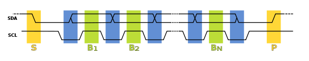

Хотя это решает проблему, для передачи сигнала часов требуется дополнительная линия. Поскольку в USB нет линии сигнала часов, возможно ли поддерживать синхронизацию между двумя концами без дополнительного сигнала часов?
Да, это возможно с использованием кодировки RZ (Return-to-zero Code), также известной как кодировка возврата к нулю.

Кодировка RZ (Return-to-zero Code)
^^^^^^^^^^^^^^^^^^^^^^^^^^^^^^^^^

Кодировка RZ (Return-to-zero Code), также известная как кодировка возврата к нулю. В кодировке RZ положительный уровень сигнала представляет логическую единицу, отрицательный уровень - логический ноль, и после передачи каждого бита данных сигнал возвращается к нулевому уровню. То есть на линии сигнала могут присутствовать три уровня: положительный, отрицательный и нулевой.

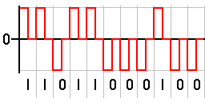

Как видно из рисунка, после передачи каждого бита сигнал возвращается к нулю, поэтому приемнику достаточно сэмплировать данные после возвращения сигнала к нулю, что исключает необходимость в отдельном сигнале часов. Фактически, кодировка RZ включает в себя синхронизацию в передаваемые данные. Такой сигнал также называется самосинхронизирующимся (self-clocking). Хотя это исключает необходимость в отдельной линии данных для часов, недостаток кодировки RZ в том, что большая часть пропускной способности данных тратится на передачу "возвращения к нулю".

Кодировка NRZ (Non-return-to-zero Code)
^^^^^^^^^^^^^^^^^^^^^^^^^^^^^^^^^^^^^^^^^^^^
NRZ кодировка (Non-return-to-zero Code) появилась как результат устранения этапа возврата к нулю, отличие NRZ от RZ состоит в том, что при NRZ не требуется возврата к нулю.

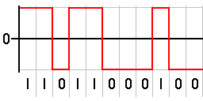

Кодировка NRZI (Non-Return-to-Zero Inverted Code)
^^^^^^^^^^^^^^^^^^^^^^^^^^^^^^^^^^^^^^^^^^^^^^^^^^^^^^^
Кодировка NRZI (Non-Return-to-Zero Inverted Code) отличается от NRZ тем, что в NRZI переворот сигнала означает одну логику, а его сохранение - другую. Об этом можно прочитать в руководстве 7.1.8.

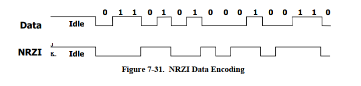

Как показано на рисунке, можно выработать простой способ запоминания: при встрече с краем 0 происходит переворот, при встрече с краем 1 изменений нет.

Битовое заполнение (bit-stuffing)
^^^^^^^^^^^^^^^^^^^^^^^^^^^^^^^^^^^^^^^^^^^^^^^^^^^^^^^
Тем не менее, даже при этом остается проблема: хотя приемник может активно синхронизироваться с частотой передатчика, всегда существует некоторая погрешность между ними. Если сигнал данных состоит из 1000 логических 1, после кодирования в USB с использованием NRZI, это будет длительный участок без изменений уровня. В такой ситуации, даже если частота приемника отличается от частоты передатчика всего на одну тысячную, это может привести к тому, что данные будут восприняты как 1001 или 999 единиц.
USB решает эту проблему с помощью принудительной вставки 0, то есть битовым заполнением (bit-stuffing). Если в передаваемых данных имеется шесть последовательных 1, перед передачей после шестой 1 принудительно вставляется 0, что заставляет сигнал передачи испытывать принудительный переход, тем самым заставляя приемник подстроить свою частоту.
Приемник, удалив 0, следующий за шестью последовательными 1, может восстановить исходные данные. Об этом можно прочитать в руководстве 7.1.9.

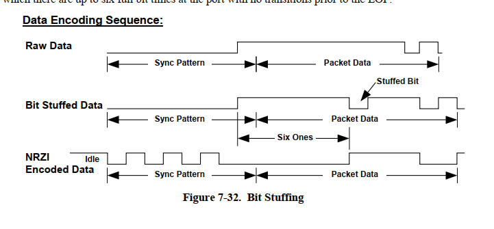
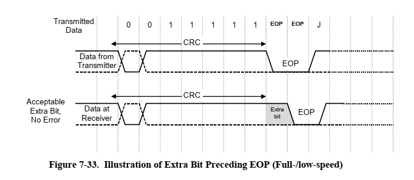
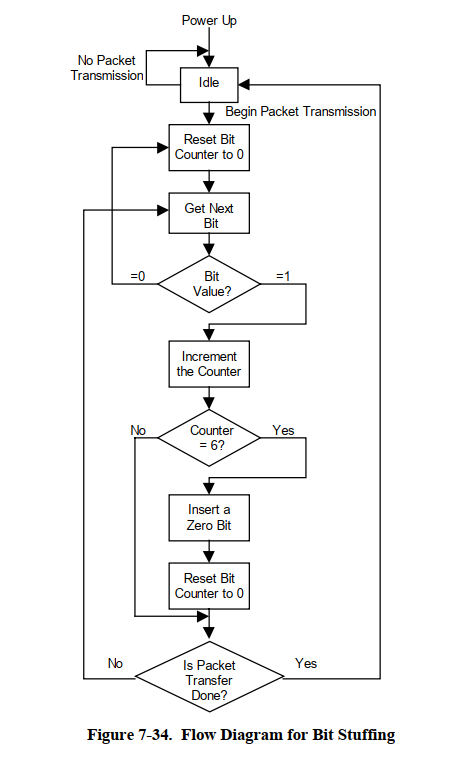

Перед кодированием данных в NRZI, в потоке данных после каждых шести последовательных 1 вставляется 0, чтобы обеспечить переход в потоке данных NRZI. Это позволяет логике приемника гарантировать по крайней мере один переход данных каждые семь бит, обеспечивая тем самым синхронизацию данных и часов. Битовое заполнение активируется с момента начала синхронизации. Данные "один", которые заканчивают синхронный режим, считаются первым "одином" в последовательности. Первый в последовательности. За исключением периода EOP высокой скорости, битовое заполнение передатчика всегда выполняется принудительно. Если это требуется согласно правилам битового заполнения, нулевой бит вставляется даже если это последний бит перед сигналом окончания пакета (EOP). Приемник должен декодировать данные NRZI, распознавать биты заполнения и отбрасывать их.

USB поля
---------------------

Поля USB составляют наименьшие и наиболее фундаментальные единицы в коммуникации USB, все пакеты и транзакции в конечном итоге состоят из полей, которые, в свою очередь, состоят из битов. Детали по полям см. в руководстве 8.1.

.. note:: USB передает биты, начиная с LSB, следуя принципу "младший бит первым".

Синхронизирующее поле
^^^^^^^^^^^^^^^^^^^^^^^^

В системе USB хост и устройство не используют общие часы, что не позволяет приемной стороне точно знать, когда передающая сторона отправляет данные. Хотя можно обнаружить начало пакета (SOP), этого недостаточно, поэтому требуется синхронизирующее поле, чтобы приемник и передатчик могли оставаться синхронизированными в процессе передачи, так что любой пакет должен начинаться с синхронизирующего поля. Синхронизирующее поле 0x01 после кодирования становится 01010100B.

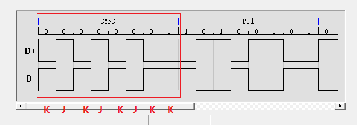

Поле идентификатора пакета
^^^^^^^^^^^^^^^^^^^^^^^^

PID состоит из четырёхбитного поля типа пакета и четырёхбитного поля контрольной суммы, занимает 8 бит, как показано на рисунке. PID указывает тип пакета и, по аналогии, формат пакета и тип ошибки при его проверке. Четырёхбитное поле контрольной суммы PID генерируется путём выполнения дополнения до двух для поля типа пакета, что обеспечивает надёжную декодировку PID для правильной интерпретации остальной части пакета. Если четыре бита проверки PID не являются дополнением до двух их соответствующих битов идентификатора пакета, то считается, что произошла ошибка PID.

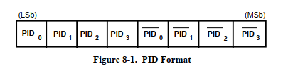

Поскольку PID состоит из 4 битов, это означает, что существует 16 типов PID, которые, в свою очередь, делятся на 4 категории: PID токена, PID данных, PID подтверждения и специальный PID.

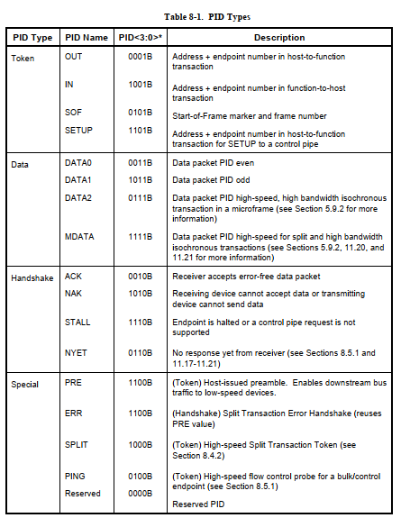

Поле адреса
^^^^^^^^^^^^^^^^^^^^^^^^

Поле адреса делится на поле адреса устройства и поле адреса конечной точки, где поле адреса устройства занимает 7 бит, за исключением адреса 0, хост может назначить 127 адресов.

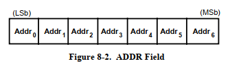

Поле адреса конечной точки занимает 4 бита, что позволяет предоставить до 16 конечных точек.

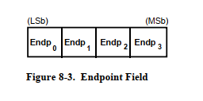

Поле номера кадра
^^^^^^^^^^^^^^^^^^^^^^^^

Поле номера кадра занимает 11 бит, и с каждым новым кадром, отправляемым хостом, номер кадра увеличивается на 1, как показано на рисунке. В случае высокоскоростных устройств в кадре содержится микрокадр, 1 кадр = 8 микрокадров, микрокадр увеличивается на 0.1. Понятия кадра и микрокадра будут дополнены позже.

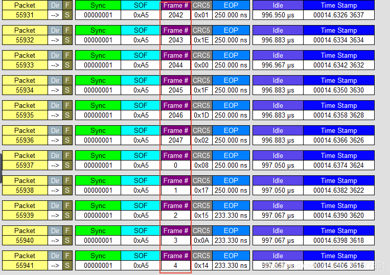

Поле данных
^^^^^^^^^^^^^^^^^^^^^^^^

Длина данных в поле данных варьируется в зависимости от типа передачи, от 0 до 1024 байт.

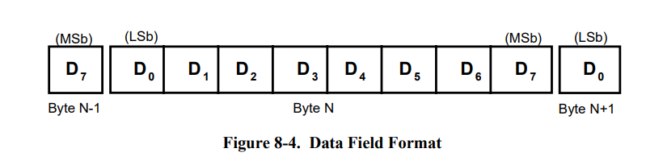

Поле CRC
^^^^^^^^^^^^^^^^^^^^^^^^

Циклическая избыточная проверка (CRC) используется для защиты всех полей, кроме PID, в пакетах токенов и данных. PID не включается в CRC проверку пакетов, содержащих CRC. Все CRC генерируются в передатчике на отдельных полях перед выполнением битового заполнения. Аналогично, CRC декодируется в приёмнике после удаления битов заполнения. CRC для токенов и данных обеспечивает 100%-ное покрытие для всех однобитных и двубитных ошибок. Сбой CRC считается признаком того, что одно или несколько защищенных полей были повреждены, что приводит к игнорированию этих полей приёмником и, в большинстве случаев, игнорированию всего пакета.

- CRC токена

Пятибитное поле CRC для токенов охватывает поля ADDR и ENDP для токенов IN, SETUP и OUT или поле временной метки для токенов SOF. Специальные токены PING и SPLIT также включают пятибитное поле CRC.

Генерирующий полином: G(X) = X^5 + X^2 + 1
Двоичное представление этого полинома - 00101B. Если все биты токена были получены без ошибок, то пятибитная контрольная сумма на приемнике будет 01100B.

- CRC данных

CRC данных - это 16-битный полином, применяемый к полю данных в пакетах данных.

Генерирующий полином: G(X) = X^16 + X^15 + X^2 + 1
Двоичное представление этого полинома - 1000000000000101B. Если все данные и биты CRC были получены без ошибок, то 16-битная контрольная сумма будет 1000000000001101B.

USB пакеты
---------------------

Пакет состоит из полей, и в зависимости от типа PID, пакеты делятся на четыре основных типа: пакеты токенов, пакеты данных, пакеты подтверждения и специальные пакеты. Содержание этого раздела смотрите в официальном руководстве 8.4.1.

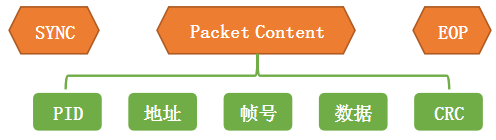

Если учесть SOP, то, как показано на рисунке, формируется полный пакет.

Пакеты токенов
^^^^^^^^^^^^^^^^^^^^^^^^

Пакеты токенов делятся на: SETUP, IN, OUT, SOF. Поля для SETUP, IN, OUT одинаковы, как показано на рисунке:

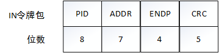

- Поле PID: определяет направление передачи данных от USB-хоста к USB-устройству.
- Поле ADDR: указывает адрес USB-устройства.
- Поле ENDP: указывает номер конечной точки, принимающей данные.
- Поле CRC: используется для циклической избыточной проверки полей ADDR и ENDP.

Поля пакета SOF, как показано на рисунке:

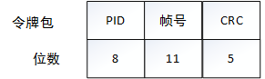

- Поле PID: определяет направление передачи данных от USB-хоста к USB-устройству.
- Поле номера кадра: указывает номер кадра USB-передачи, состоящий из 11 бит.
- Поле CRC: используется для циклической избыточной проверки полей ADDR и ENDP.

Пакеты данных
^^^^^^^^^^^^^^^^^^^^^^^^

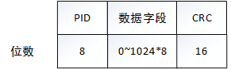

- Поле PID: указывает различные типы пакетов данных. Поддерживаются 4 типа пакетов данных: DATA0, DATA1, DATA2 и MDATA.
- Поле данных: содержит передаваемые данные. Размер данных зависит от класса передачи данных и потребностей клиента. Согласно спецификациям USB, для медленного USB максимальная длина данных составляет 8 байт, для полноскоростного USB - 1023 байта, для высокоскоростного USB - 1024 байта.
- Поле CRC: здесь используется 16-битная циклическая избыточная проверка для защиты поля данных.

Пакеты подтверждения
^^^^^^^^^^^^^^^^^^^^^^^^

Пакеты подтверждения состоят из 8-битного поля PID и используются для сообщения о статусе текущей передачи данных в конце передачи. Пакеты подтверждения также являются сигналом окончания всей транзакции.

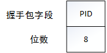

Специальные пакеты
^^^^^^^^^^^^^^^^^^^^^^^^

USB транзакции
---------------------

В USB существуют три основных типа транзакций: SETUP, IN и OUT. Кроме транзакций управления, которые используют все три типа, другие типы передач используют две транзакции. Специальные транзакции - это транзакции без передачи данных.

Транзакция SETUP
^^^^^^^^^^^^^^^^^^^^^^^^

Транзакция IN
^^^^^^^^^^^^^^^^^^^^^^^^

Транзакция OUT
^^^^^^^^^^^^^^^^^^^^^^^^

Специальные транзакции
^^^^^^^^^^^^^^^^^^^^^^^^

USB передача
---------------------

Управляющая передача
^^^^^^^^^^^^^^^^^^^^^^^^

Пакетная передача
^^^^^^^^^^^^^^^^^^^^^^^^

Передача с прерыванием
^^^^^^^^^^^^^^^^^^^^^^^^

Синхронная передача
^^^^^^^^^^^^^^^^^^^^^^^^
