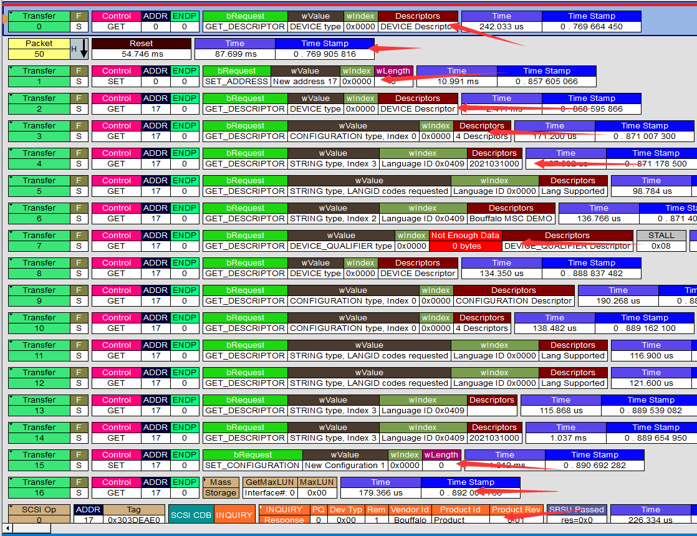

USB Перечисление
===========================

После того, как мы ознакомились с запросами USB-устройств, мы можем изучить процесс перечисления USB-устройств, чтобы узнать, как перечисляются такие устройства, как последовательные порты, мыши, USB-накопители и т.д. В процессе перечисления хост отправляет запросы устройству, чтобы получить связанную информацию (то есть дескрипторы). Какие именно запросы отправляются, смотрите на следующем рисунке.

- Сначала подключаем устройство к USB-кабелю, затем подключаем его к компьютеру
- После подключения устройство включается и находится в состоянии питания
- Хост распознает подключение устройства через линии D+/D-
- Выполняется сброс устройства
- Хост отправляет **запрос на получение дескриптора устройства**
- Возможна операция сброса
- Хост отправляет **запрос на установление адреса устройства**
- Хост отправляет **запрос на получение дескриптора конфигурации**, возможно, запрос будет отправлен несколько раз, это не принципиально
- Хост отправляет **запрос на получение строковых дескрипторов**, обычно запрашиваются три строки, если дальнейшие дескрипторы указывают строки, продолжается получение указанных строк
- Хост отправляет **запрос на получение дескриптора квалификации устройства**, чтобы получить информацию о работе устройства на других скоростях. Если устройство может работать только в полнодуплексном режиме, оно должно ответить сталлом, и стек протоколов обязательно выведет этот запрос, чтобы сообщить вам, что команда не поддерживается устройством.
- Хост отправляет **запрос на установление конфигурации**, выполняя настройку конечных точек устройства, обычно в соответствии с настройками, указанными в дескрипторе конечных точек.
- На этом завершаются стандартные запросы устройства
- Хост загружает драйвер класса, поддерживаемый описателем интерфейса, если хост не поддерживает этот класс, будет выведено сообщение о том, что драйвер устройства не найден
- После загрузки драйвера начинается выполнение запросов, связанных с данным классом
- В конечном итоге происходит передача данных, связанная с классом
